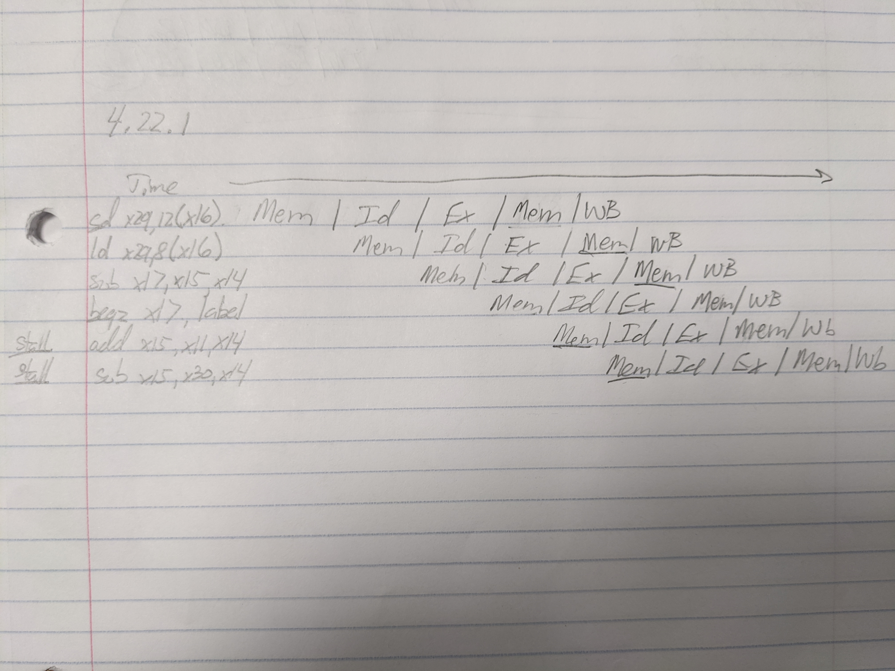
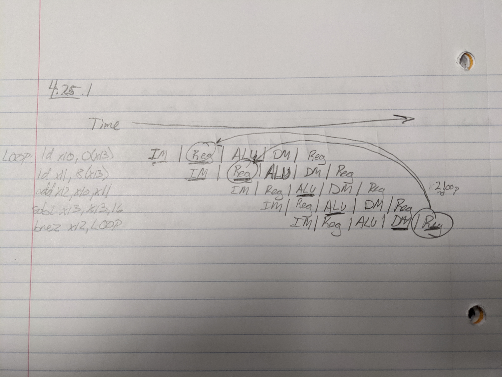

# Homework 4
## Erik Sorensen

### Control	4.2, 4.4.1, 4.4.2, 4.6.1, and 4.6.2

#### 4.2. Explain each of the "dont't cares in Figure 4.18"

The MemtoReg field is irrelevant when the RegWrite signal is 0: since the register is not being written, the value of the data on the register data write port is not used.

#### 4.4.1. Which instructions fail to operate correctly if the MemToReg wire is stuck at 0?

ld will fail to work since the MemtoReg needs to be 1.

#### 4.4.2. Which instructions fail to operate correctly if the ALUSrc wire is stuck at 0?

both ld and st will fail to work since ALUSrc must be 1 for these instructions to work.

#### 4.6.1. What additional logic blocks, if any, are needed to add I-type instructions to the CPU shown in Figure 4.21? Add any necessary logic blocks to Figure 4.21 and explain their purpose.

No additional logic blocks are needed to add I-type instructions to the CPU shown in Figure 4.21. The only thing that would change would be that inside the register block we would not have a read register 2. However, all of the bits still go to the Register block for I instructions. We can control the bits that we need from the register using the control block.


#### 4.6.2. List the values of the signals generated by the control unit for addi. Explain the reasoning for any "don't care" control signals.

```
Branch   : 0
MemRead  : X
MemToReg : X
ALUOp    : 1
MemWrite : 0
ALUSrc   : 1
RegWrite : 1
```

We do not care about MemRead or MemToReg because MemWrite is 0. So the Memory Block is not used at all so it doesn't matter what MemRead or MemToReg is.

### Performance	4.10.1, 4.10.2, and 4.10.3

#### 4.10.1. What is the speedup achieved by adding this improvement (in 4.10)?

Assuming we have 1000 total instructions, using the instruction mix from Exercise 4.8, we have:

520 R-type/ I-type instructions, <br>
250 ld instructions, <br>
110 sd instructions, and <br>
120 beq instructions

With a 12% reduction of ld and st instructions, we now have:

220 ld instructions and <br>
97 st instructions.

Now, assigning a total latency cost to each instruction using Figure 4.21 to find the worst case path for each instructions we get the following costs:

R-type / I-type Instructions : 150 + 20 + 25 + 200 + 250 + 25 + 200 + 25 = 895ps <br>
ld : 25 + 200 + 250 + 25 + 25 + 150 = 675ps <br>
st : 25 + 250 + 25 + 30 = 300ps <br>
beq : 25 + 200 = 225

Now, adding all of these latency estimates to the old number of instructions:

```
execution time before = (520 * 895ps) + (250 * 675ps) + (110 * 300) + (120 * 225)
                      = 694150ps

execution time after  = (520 * 895ps) + (220 * 675ps) + (97 * 300) + (120 * 225)
                      = 670000ps

performance = 1 / execution time

performance before = 1 / 694150ps = 1.4406e-6
performance after  = 1 / 670000ps = 1.4925e-6
```

This is a speedup of almost 4 percent.

#### 4.10.2. Compare the change in performance to the change in cost.

Assigning cost to each instruction we get:

R-type / I-type: 30 + 200 + 10 + 1000 + 10 + 100 + 10 = 1360
ld : 10 + 1000 + 100 + 10 + 10 + 30 + 200 = 1360
st : 10 + 1000 + 10 + 200 = 1220
beq : 10 + 100 = 110

Now adding the double cost to the register file we get:

R-type = 1560
ld = 1560
st = 1420
beq = 110

Computing the total cost for before and after:

```
Total cost before = 1360 + 1360 + 1220 + 110 = 4050
Total cost after  = 1560 + 1560 + 1420 + 110 = 4650

```

This is a cost increase of almost 15 percent.

Comparing cost vs performance, we have an increase in cost by 15 percent while the performance increased by 4 percent.

Therefore, the cost/performance ratio is 15/4 or 3.75 for the upgrade.

#### 4.10.3. Given the cost/performance ratios you just calculated, describe a situation where it makes sense to add more registers and describe a situation where it doesn't make sense to add more registers.

Any time that we have operations that have lots of loads and stores it makes sense to add more registers because we will incur less of a cost. This is due to the fact that if we have more registers, we will not take the path to store to memory as often, or in other words, we will not have register spill into memory. This operation takes a long time in performance latency (250ps) and reducing the number of times we go there will see this performance gain. This performance gain could also be worth the cost, as a 4% performance gain is pretty significant if all we have to do is add more registers.

However, if we are not doing operations that require a lot of registers, then it does not make sense to spend the cost to increase the number of registers. Since we would not need as many registers, we don't write to memory as often because we don't run the risk of register spillage. So an increase in the number of registers does not make sense in this case, as we would add more cost but we would not see the performance gain.

### Pipelining	4.22.1, 4.22.2, 4.22.3, 4.22.4, and 4.25.1, 4.25.2

```
sd      x29, 12(x16)
ld      x29, 8(x16)
sub     x17, x15, x14
beqz    x17, label
addi    x15, x11, x14
subi    x15, x30, x14
```

#### 4.22.1. Draw a pipeline diagram to show were the code above will stall.



#### 4.22.2. In general, is it possible to reduce the number of stalls/ NOPs resulting from this structural hazard by reordering code?

Yes. If we move the addi and subi instructions to before the beqz we can reduce the number of stalls from this structural hazard.

#### 4.22.3. Must this structural hazard be handled in hardware? We have seen that data hazards can be eliminated by adding NOPs to the code. Can you do the same with this structural hazard? If so, explain how. If not, explain why not.

Yes. We can add a stall to delay the add and subi commands by one clock cycle after we are finished using memory in the ld and st commands. This stall would free up the memory block which would allow add and subi to access the data in the registers.

#### 4.22.4. Approximately how many stalls would you expect this structural hazard to generate in a typical program? (Use the instruction mix from Exercise 4.8)

Assuming we are running 1000 iterations of these instructions, we get:

520 R-type/ I-type instructions, <br>
250 ld instructions, <br>
110 sd instructions, and <br>
120 beq instructions.

Due to this structural hazard, we would stall as a result of the sd and ld instructions. Therefore, we would stall 250 + 110 = 360 times, since we stall once for each of the sd and ld commands given the instruction mix from 4.8. Therefore, for a total number of 1000 instructions, we would have (1000/5) + 360 = 560 clock cycles which is a slowdown of 560/200 or 2.8 times due to this structural hazard. This is because since we have 5 steps we are pipelining (running in parallel) the normal number of clock cycles would be 1000/5. However, we must add a clock cycle every time we do ld or st due to the stall becasue of the memory being shared, which adds 250+110 clock cycles to our total benefits due to the pipeline.

#### 4.25.1. Show a pipeline execution diagram for the first two iterations of this loop.



#### 4.25.2. Mark pipeline stages that do not perform useful work. How often while the pipeline is full do we have a cycle in which all five pipeline stages are doing useful work? (Begin with the cycle during which the subi is in the IF stage. End with the cycle during which the bnez is in the IF stage.)

The bnez command does not do any useful work most of the time because it is dependent on the updated registers from subi to loop back to the correct register. Therefore, it must wait a full extra clock cycle for those registers to be completed before bnez can do its check and loop back. The only time the pipeline is full is when the condition for bnez is not fulfilled, because it does not need to have the register to loop back to, it just ends the loop.
