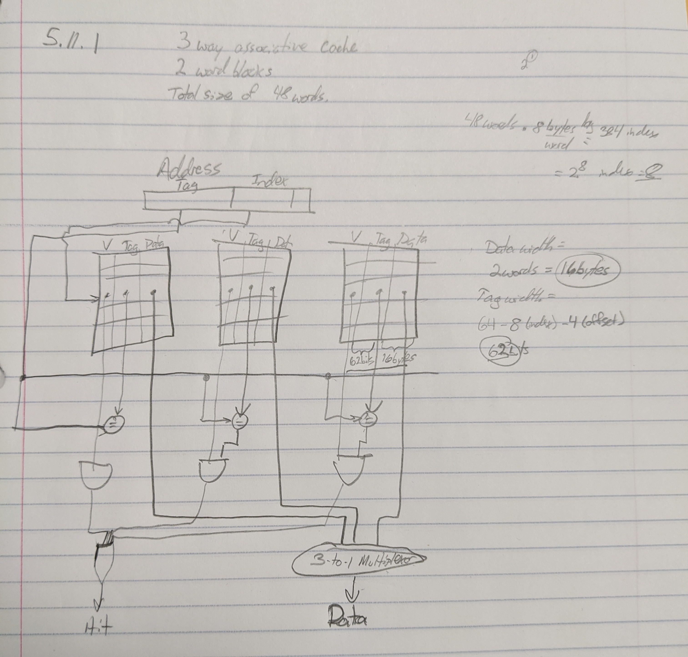
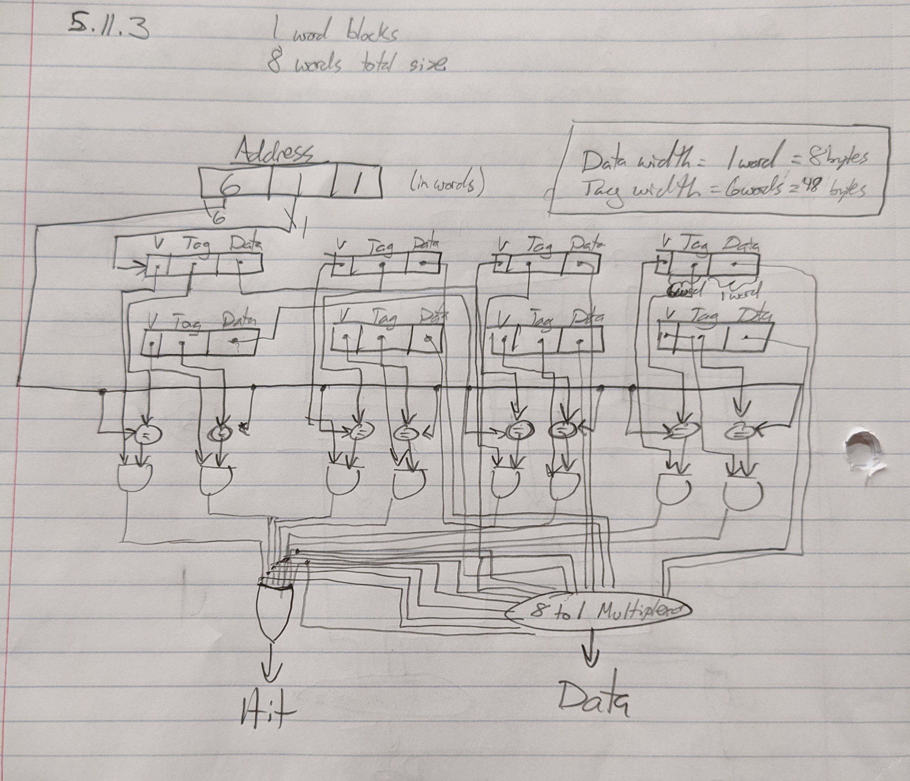

# HW5
## Erik Sorensen
## 12/6/19

### Cache

#### 5.1.1

2 64 bit integers can be stored in a 16 byte cache. (64 bits = 8 bytes * 2 bytes = 16 bytes)

#### 5.1.2

The variables I and J both exhibit temporal locality because they will be accessed very soon on the next iteration of the for loop.

#### 5.1.3

The variables A and B exhibit spatial locality because those two variables are always used together to perform some computation so they are related and should be stored in close proximity in memory to each other.

#### 5.3.1

Number of bits to implement a 32 KiB cache with 2 word blocks

32 KiB = 8192 words = 2^13

with a block size of 2 words (2^1) there are 4096 (2^10) blocks. Each block has 4 x 32 or 128 bits of data plus a tag which is 64 - 19 - 2 - 2 bits, plus a valid bit. Thus the complete cache size is:

2^10 * (4 * 32 + (64 - 10 - 2 - 2) + 1) =  2^10 * 179 = 179 Kibibits.

#### 5.5.1

The block size is 2^m words (2^(m+2) bytes), so m bits are used for the word within the block ,and two bits are used for the byte part of the address.

The block size is 2^5 = 32 bytes so in words that is 32 bytes / 8 bytes/word = 4 words

#### 5.5.2

The cache has 2^n blocks, where n is the index.

So this iteration has 2^5 blocks = 32 blocks

#### 5.5.3

For data we have:

32 bytes * 8 bits/byte * 32 indexes = 8192

For other bits we have:

54 bits * 32 indexes + 32 value bits = 1760

Therefore the ratio of total bits required over the data storage bits is:

1760 + 8192 / 8192 = 1.21

#### 5.11.1

#### 5.11.2

Convert to binary:

| hex | binary | tag | index | offset | hit or miss | which cache way is it in? |
| -- | -- | -- | -- | -- | -- | -- |
| 0xb4 | 1011 0100 | 10110 | 10 | 0 | miss | 1 |
| 0x03 | 0000 0011 | 00000 | 01 | 1 | miss | 1 |
| 0x2b | 0010 1011 | 00101 | 01 | 1 | miss | 2 |
| 0x02 | 0000 0010 | 00000 | 01 | 0 | hit  | 1 |
| 0xbe | 1011 1110 | 10111 | 11 | 0 | miss | 1 |
| 0x58 | 0101 1000 | 01011 | 00 | 0 | miss | 1 |
| 0xbf | 1011 1111 | 10111 | 11 | 1 | miss | 1 |
| 0x0e | 0000 1110 | 00001 | 11 | 0 | miss | 2 |
| 0x1f | 0001 1111 | 00011 | 11 | 1 | hit  | 1 |
| 0xb5 | 1011 0101 | 10110 | 10 | 1 | miss | 2 |
| 0xbf | 1011 1111 | 10111 | 11 | 1 | hit  | 1 |
| 0xba | 1011 1010 | 10111 | 01 | 0 | hit  | 3 |
| 0x2e | 0010 1110 | 00101 | 11 | 0 | hit  | 2 |
| 0xce | 1100 1110 | 11001 | 11 | 0 | hit  | 3 |

#### 5.11.3

#### 5.11.4

| hex | binary | tag | index | offset | hit or miss |
| -- | -- | -- | -- | -- | -- |
| 0xb4 | 1011 0100 |101101 | 0 | 0 | miss |
| 0x03 | 0000 0011 |000000 | 1 | 1 | miss |
| 0x2b | 0010 1011 |001010 | 1 | 1 | miss |
| 0x02 | 0000 0010 |000000 | 1 | 0 | hit  |
| 0xbe | 1011 1110 |101111 | 1 | 0 | miss |
| 0x58 | 0101 1000 |010110 | 0 | 0 | miss |
| 0xbf | 1011 1111 |101111 | 1 | 1 | hit  |
| 0x0e | 0000 1110 |000011 | 1 | 0 | miss |
| 0x1f | 0001 1111 |000111 | 1 | 1 | miss |
| 0xb5 | 1011 0101 |101101 | 0 | 1 | hit  |
| 0xbf | 1011 1111 |101111 | 1 | 1 | hit  |
| 0xba | 1011 1010 |101110 | 1 | 0 | miss |
| 0x2e | 0010 1110 |001011 | 1 | 0 | miss |
| 0xce | 1100 1110 |110011 | 1 | 0 | miss |

The contents of the cache after each reference has been handled?

|Cache| Contents|
| -- | -- |
|1   | 0000 0011 |
|2   | 0010 1011 |
|3   | 1011 1110 |
|4   | 0101 1000 |
|5   | 0001 1111 |
|6   | 1011 1010 |
|7   | 0010 1110 |
|8   | 1100 1110 |

### Virtual Memory

#### 5.18.1

#### 5.18.2

#### 5.18.3

#### 5.18.4

#### 5.18.5

#### 5.22

### One question that I did not know how to answer and why.
