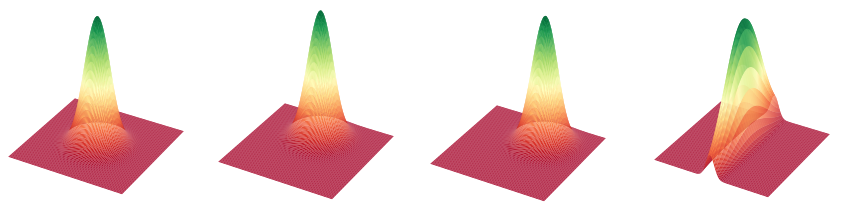

<!-- # Quantum Neural Network for Reinforcement Learning

#### Erik Sorensen
#### Data Science Honors Project Proposal -->

## Introduction
<!-- Why reinforcement learning?
Why Neural Networks
Why Quantum Neural Networks? -->

Quantum computing and machine learning are two exciting fields. Quantum computing brings a new perspective on computers by using properties of quantum mechanics to do computations, which can be much faster than the classical computers we know today. Not only are they faster, but some tasks that we thought to be impossible with classical computers are possible with quantum computers. [10] Machine learning learns complex problems from large amounts of data that are too difficult for humans to manually solve. It has been used in facial recognition [11] and identifying weeds in precision agriculture [12]. A more recent sub-field of machine learning is *reinforcement learning*. Reinforcement learning uses a positive or negative reinforcement signal from an environment, known as the *reward*, to provide feedback to the learning system so that it may learn and improve to maximize this reward. Some areas that use reinforcement learning are economics and artificial intelligence in games [13]. Reinforcement learning is an attractive tool to use. While other machine learning techniques often times require a well tuned, large dataset to learn, reinforcement learning only requires a reward from an environment and time to train. Even further, using a quantum computer to do reinforcement learning has the potential to solve problems that would be too computationally complex for classical computers to solve. This increases the scope of problems we can solve exponentially.

## Reinforcement learning

<!-- Example to understand it -->

Reinforcement learning may be applied to many fields. As an example, I will use a vacuuming robot to show a specific use case of how reinforcement learning can be applied in the world. Let's imagine if this robot used reinforcement learning techniques. The robots main goal is to vacuum an *environment*, say a living room, while avoiding furniture and other obstacles.

With reinforcement learning, the robot can self-teach itself by exploring the room. The only feedback the robot gets is *observations* about its surroundings via sensors, and a *reward* signal that indicates how well the robot is doing at its job. The *state* of the robot is defined by the observations the robot makes about its surroundings at a certain time. Based on this state, the robot will take an *action* and will receive either a positive reward signal for good actions or a negative reward signal for bad actions. These actions could be either going left or right, or going back to its charging station. The robots goal then is to maximize this positive reward signal so that it knows it is doing a good job. The part of the robot that decides the next action it should take we will call the *agent*.

How then can the robot learn to efficiently do this task with these tools it has at its disposal? This problem is called the reinforcement problem [1], which gives the instructions for most reinforcement learning algorithms. It is stated here:

> For an agent in a certain state at a certain time, what action should be taken that will maximize the overall reward, now and in the future?

To summarize, the goal of reinforcement learning is to find a *policy* which maximizes the *reward*. A *policy* ($\pi$) is a probability distribution that describes the probability the agent will take a certain action given it is in a certain state. The *optimal policy* is a policy that on average receives the greatest total reward. This is useful, especially in terms of the vacuuming robot who does not know anything about the environment it has been placed in. By defining the rewards the robot will seek, it will teach itself how to best maximize this reward in the environment. Say we define the robots reward as avoiding furniture in the environment, it will then learn the best paths it can take to avoid these obstacles. All methods of reinforcement learning have this same goal, which is to find the optimal policy to maximize reward.  

### Value Function and Action-Value Function

One method for discovering the optimal policy is to estimate the value of the reward the agent receives in each state. Once this value is known, the best action an agent can take is the one that will accumulate the highest value across all future states. This method is called value iteration which returns a prediction of the expected accumulative, discounted, future reward, measuring how good each state is [2]. The expected total reward is called the return. The value function is described by,

$$V(s) = E\{R_t | s_t = s\}$$

where $E$ is the expected value operator, $R_t$ is the total return that an agent receives given state $s_t$ at time $t$, and $s$ is the current state that the agent is in. Another solution to finding the optimal policy is called Q-learning. Q-learning expands on the value function where instead of determining the value of being in a certain state, it maximizes the reward over infinitely many successive steps, starting from the current state. The action-value function is given by,

$$Q(s,a) = E \{ r_{t+1} + \gamma V(s_{t+1}) | s_t = s, a_t = a \}$$

where $r_{t+1}$ is the reward from moving into state $s_{t+1}$ from $s_t$ by taking action $a$ [3]. The action-value function has many benefits for learning, one of which is that it integrates well with *online learning*. Online learning algorithms are executed on data acquired in sequence [2]. The agent will use the current estimate of the optimal policy while exploring the environment in search of a better estimate of the optimal policy.

Q-learning is a famous reinforcement learning algorithm that uses the action-value function to converge on the optimal policy iteratively, meaning that after each step it obtains a better estimate of the action-value and will eventually converge on the true optimal policy values for each step [3]. The formula for Q-learning is given by,

$$ Q(s_t,a_t) \leftarrow Q(s_t,a_t) + \alpha [ r_t + \gamma \max_a Q(s_{t+1},a) - Q(s_t,a_t) ] $$

[4], where $Q(s_t,a_t)$ is the *action value*, $s_{t+1}$ is the state moved to out of $s_t$ by taking action $a_t$, $r_t$ is the reward from this transition, $\alpha$ is the learning rate, and $\gamma$ is the discount rate which describes the amount we reduce future rewards.

Using the action-value function has two main advantages over the value function for learning. Firstly, it is easier to learn the action-value function to determine the optimal policy. Second, it is a simple task to evaluate policies with the action-value function because the next action of the agent is always the action that maximizes the action-value function (i.e. $a = argmax_{a'}Q(s,a')$).

<!-- Do I need to implement an other techniques section? -->

## Deep Reinforcement learning

### Neural Networks

Often, the action-value function $Q(s,a)$ is represented as a table, where each state-action pair $s,a$ maps to a particular reward value in the table. Generally, this table can get quite large with big environment spaces, sometimes they can be nearly *continuous* in size. In these scenarios, Q-learning becomes impractical because the table becomes much too large to converge on the optimal policy in a reasonable amount of time. Instead of this approach, we can try to approximate a function $f(s,a)$ of $Q(s,a)$ so that instead of directly learning each value in the table, we can learn the *parameters* of this function instead.

<!-- This paragraph confuses me I think, could be written better -->
To do this, we can use *function approximation*. Function approximation methods expect to receive examples of the desired input-output behavior of the environment they are trying to approximate. We use these methods for value prediction simply by passing the state of each update as a training example, instead of both the state *and* the action. We then interpret the approximate function they produce as an estimated *value function* [5]. Therefore, instead of saving the values in the Q-table to determine the best next action, we are taking better actions at each time step in accordance with the learned function approximator.

Once we frame the problem as a function approximation problem, we can use *neural networks* to learn the approximation of these functions. Neural networks are a computer learning algorithm that is modeled after a simplified version of biological neurons that are grouped into *layers*, where each layer is the result of previous layers multiplied by a *weight*. <!--Neural networks must be trained by a technique called *supervised learning*, which is a machine learning task of learning a function that maps an input to an output based on example input-output pairs collected from an environment. -->Usually, supervised learning is done for classification problems, but neural networks may be applied to other problems by carefully selecting an *activation function*. An activation function is a function that describes the output of a neuron. Usually, activation functions compress the outputs of neurons into a sigmoidal shape within a certain range, similarly to how biological neurons are activated.

### Q-Networks <!-- visit https://medium.freecodecamp.org/an-introduction-to-deep-q-learning-lets-play-doom-54d02d8017d8 for clarification -->

<!-- Rewrite this section to make it more concise with less derivations of the formulas and more ideas of what it is supposed to do because my paper will not use Q-Networks it will use policy gradients and other policy approximator methods -->

<!-- What is Q-learning. Function approximator.
    Why do we use it
    What is the math behind it -->

When neural networks are applied to Q-learning they are called Q-Networks [6]. Recall the formula for Q-learning written previously. With neural networks, we want to update the weights of the neural network to reduce the error, more specifically the *Temporal Difference Error* (TD). The TD error is calculated as follows,

$$ TD = (r + \gamma \max_a Q(s_{t+1},a,\theta)) - Q(s_t,a_t,\theta).$$

As seen above, the TD error is the difference between the maximum possible value for the next state and the current prediction of the Q-value. Now that we can judge how well we are predicting the value of the next steps, we need a formula for improving the weights of our neural network so that it can continuously improve its predictions over each time step $t$. To do this, we can use *gradient descent*, which is used to update the weights ($\theta$) of our neural network so as to minimize the TD error. Adding gradient descent to our formula we get,

$$ \theta \leftarrow \theta + \alpha [ r + \gamma \max_a Q(s_{t+1},a;\theta) - Q(s_t,a_t;\theta)] \nabla_\theta Q(s_t,a_t;\theta).$$

Q-Networks work very well on large environments, especially when there are many layers involved. Q-Networks with many layers of neurons can train much faster and are called *Deep Q-Networks*. However, Q-Networks have trouble when we have a continuous action space because they compute the maximum expected future reward for each possible action at each time step given some state. But when we have infinite possibilities of actions, computing the maximum expected future reward for each action becomes impossible.

<!--
__________________________________________________________________________

When Neural Networks are applied to Q-learning they are called Q-Networks [6]. We can rewrite the update formula for Q-learning written previously to frame it like a supervised learning problem for Q-Networks. If we let $y_t = r_t + \gamma max_a Q(s_{t+1},a)$, then

$$ Q(s_t,a_t) \leftarrow Q(s_t,a_t) + \alpha [y_t - Q(s_t,a_t)].$$

The last thing we need is instructions for how the Q-Network can learn. The quantity $\nabla_Q L = -[y_t - Q(s_t,a_t)]$ can be obtained by taking the gradient of the quadratic loss function $L$ with respect to $Q(s_t,a_t)$:

$$ L \equiv \frac{1}{2} [y_t - Q(s_t,a_t)]^2. $$

The update formula now adjusts $Q(s,a)$ to minimize the value of $L$. This is called *gradient descent*. A Q-Network is represented by the function $Q(s,a;\theta)$, where $\theta$ represents the parameters of the neural network being used to estimate the true action-value. Using $\theta$ in our loss function, we can now obtain a gradient with respect to the parameters $\theta$,

$$ \nabla_\theta L = -[y_t - Q(s_t,a_t;\theta)] \nabla_\theta Q(s_t,a_t;\theta). $$

Like we did before, we can use gradient descent to learn our network parameters $\theta$,

$$ \theta \leftarrow \theta + \alpha [ r + \gamma \max_a Q(s_{t+1},a;\theta) - Q(s_t,a_t;\theta)] \nabla_\theta Q(s_t,a_t;\theta).$$

Having a reinforcement learning algorithm expressed in this way has many benefits. Lets think back to our vacuuming robot example. Say the robot is tasked with vacuuming a dining room. The dining room has specific characteristics that define it, say a table and several chairs. The robot can now identify this room based on its characteristics and can now effectively identify and vacuum the room based on that identification.

-->

### Deterministic Policy Gradient Theorem and Actor Critic Algorithms

The *policy gradient* is one of the most popular methods of continuous variable learning algorithms. Instead of estimating a value function which becomes expensive with many actions, we learn directly the policy function that maps state to action. This means that we no longer have to optimize the state $s$ and action $a$, and save their results. The idea with policy gradient methods is to adjust the parameters $\theta$ toward the direction of the performance gradient $\nabla_\theta J(\pi_\theta)$. The fundamental result underlying this idea is called the *policy gradient theorem* [8]. Normally, the policy gradient is modeled as a probability distribution over actions and is therefore *stochastic*. In our case, we will be looking at a derivative of the policy gradient theorem, *Deterministic Policy Gradient Theorem* (DPG) [20], which models the actions taken as a deterministic decision $a = \mu(s).$ This is stated as follows,

<!-- These functions need to be changed into the same semantics I used for my other functions
$$ \nabla_\theta J(\pi_\theta) = \int_S p^\theta(s) \int_A \nabla_\theta \pi_\theta (a|s) Q^\pi(s,a) \mathrm{d}a\mathrm{d}s$$

$$ = \mathbb{E}_{s \textasciitilde p^\pi , a \textasciitilde \pi_\theta} [\nabla_\theta \log \pi_\theta (a|s) Q^\pi(s,a)] $$
-->

$$ \nabla_\theta J(\theta) = \int_S p^\mu(s)\nabla_a Q^\mu(s,a)\nabla_\theta \mu_\theta(s) | a=\mu_{\theta(s)} \mathrm{d}s $$

$$ = \mathbb{E}_{s \textasciitilde p^\mu} [ \nabla_a Q^\mu(s,a) \nabla_\theta \mu_\theta(s) | a=\mu_{\theta(s)}]. $$

This formula is actually simpler to compute than Q-Networks because the policy gradient does not depend on the gradient of the action distribution which in turn reduces the computation of the performance gradient to a simple approximation. Once we can measure the quality of our policy $\mu$ we can use *gradient ascent* to maximize the expected reward of our performance gradient $\nabla_\theta J(\theta)$. Because of the reduced computation, policy gradient algorithms learning is more stable than Q-Networks. Convergence is also a guarantee, whether it's a local maximum (worst case) or global maximum (best case). The most important factor of policy gradients is that it is now possible to learn in an environment with a continuous action space which makes policy gradients fundamental in learning in continuous spaces.

<!-- Talk about the downsides of dpg and how to fix -->

The *actor-critic* is a widely used architecture that combines ideas from Q-Networks and the policy gradient theorem [9]. The actor-critic contains two separate neural networks, an *actor* and a *critic*, that work together to learn an environment. Similarly to the policy gradient theorem, the *actor* controls how the agent behaves by adjusting the parameters $\theta$ of the policy $\pi_\theta(s)$ by gradient ascent. However, instead of the unknown true action-value function $Q^\pi(s,a)$, the action-value function $Q^w(s,a)$ is used, with the parameter $w$. The *critic* measures how good the action taken by the actor is by estimating the action-value function $Q^w(s,a) \approx Q^\pi(s,a)$ using an evaluation algorithm such as temporal-difference learning *at each time step* $t$, similarly to how Q-Networks learn. Because we have two neural networks, we have two parameters $\theta$ and $w$ that must be optimized separately in parallel for each of the neural networks,

$$ \Delta \theta = \alpha \nabla_\theta(\log \pi_\theta(s,a))\hat{q}_w(s,a), $$

$$ \Delta w = \beta(R(s,a) + \gamma \hat{q}_w(s_{t+1},a_{t+1}) - \hat{q}_w(s_t,a_t)) \nabla_w \hat{q}_w(s_t,a_t), $$

where $\alpha$ and $\beta$ are separate learning rates.
The actor-critic model has many advantages over the policy gradient method. For one, learning is more stable and faster because the parameters are updated at each time step with TD learning instead of at the end of each episode. Another issue with policy gradients is that it takes the average reward over every step in an episode. That means it could identify an episode as good even if there were some bad actions because the total reward was extracted. With the actor-critic model, each action the actor takes is critiqued individually so it takes less episodes to converge on the optimal policy.

An extension of these algorithms is *Deep Deterministic Policy Gradients* (DDPG) [21] which extends DPG to work in a continuous space with the actor critic framework to learn a deterministic policy. One downside of the DPG algorithm is that the agent no longer explores the environment and always takes the action with the maximum expected reward. This is due to the fact that we no longer have a probability distribution of actions the agent can take. To fix this problem, DDPG adds noise $N$ at every step, $\mu'(s) = \mu_\theta(s) + N$ where $N$ is a normal random value. The entire algorithm is listed in Algorithm 1.

<!-- be sure to install texlive-science do do this -->
\begin{algorithm}
\caption{DDPG algorithm}
\begin{algorithmic}

\STATE Randomly initialize critic network $Q(s,a|\theta^Q)$ and actor $\mu(s|\theta^\mu)$ with weights $\theta^Q$ and $\theta^\mu$
\STATE Initialize target network $Q'$ and $\mu'$ with weights $\theta^{Q'} \leftarrow \theta^Q , \theta^{\mu'} \leftarrow^\mu$
\STATE Initialize replay buffer $R$
\FOR{ $ episode = 1 , M$}
\STATE Initialize a random process $N$ for action exploration
\STATE Receive initial observation state $s_1$
\FOR{$t = 1, T$}
\STATE Select action $a_t = \mu(s_t|\theta^\mu) + N_t$ according to the current policy and exploration noise
\STATE Execute action $a_t$ and observe reward $r_t$ and observe new state $s_t + 1$
\STATE Store transition $(s_t,a_t,r_t,s_{t+1}$ in $R$
\STATE Sample a random minibatch of $N$ transitions $(s_i,a_i,r_i,s_{i+1}$ from $R$
\STATE Set $y_i = r_i + \gamma Q'(s_{i + 1}, \mu'(s_{i+1}|\theta^{\mu'})|\theta^{Q'})$
\STATE Update critic by minimizing the loss: $L = 1/N \sum{i} (y_i - Q(s_i,a_i | \theta^Q))^2$
\STATE Update the actor policy using the sampled policy gradient:
$$ \nabla_{\theta \mu} J \approx 1/N \sum{i} \nabla_a Q(s,a|\theta^Q)|{s=s_i,a=\mu(s_i)} \nabla {\theta\mu} \mu(s|\theta^\mu)|s_i $$
\STATE Update the target networks:
$$ \theta^{Q'} \leftarrow \tau \theta^Q + (1 - \tau) \theta^{Q'}$$
$$ \theta^{\mu'} \leftarrow \tau\theta^\mu + (1 - \tau) \theta^{\mu'}$$
\ENDFOR
\ENDFOR
\end{algorithmic}
\end{algorithm}

Modern computers can handle the computation of *deep reinforcement learning*, termed deep because of the many layers used in neural networks, much better than Q-learning because of recent techniques in parallelization and GPU matrix multiplication [7]. Furthermore, the framework of neural networks is highly flexible because of activation functions and can be adapted to advanced RL techniques such as Q-Networks, the policy gradient theorem, and actor-critic models. The continuous nature of neural networks also allow us to practice RL with *continuous variable quantum computing* to train large RL algorithms much quicker.

## Continuous Variable Quantum Computing

<!-- Will need to add some citations in here I think -->
Quantum computing is a completely new way to think about computing. Quantum computing uses quantum phenomena like superposition and entanglement to do computation. A classical computer is made up of bits, and a bit can either be a 1 or a 0. Similarly, a quantum computer is made up of *qubits* which is either a 1, 0, or any quantum superposition of the two. Because of this, Quantum computers have the potential to be much more powerful than classical computers. A quantum computer with $n$ qubits can be in *any* superposition of up to $2^n$ different states, while a classical computer can only be in *one* of those $2^n$ states at any one time. Because quantum computers can be in any of the states at the same time, they are probabilistic, meaning that each state has a certain probability of being selected when measured. The state of the qubits are manipulated using *quantum gates* and multiple gates applied to qubits make up a quantum algorithm. To see the result of the quantum algorithm the qubits must be *measured*, which removes the quantum properties and <!-- is this correct? -->probabilistic nature of the bits and converts them into an output of either 1 or 0.

Another popular model of quantum computing is continuous variable (CV) quantum computing. The qubit based quantum computing model is discrete in nature due to the qubits generally being 0 or 1. The CV model, however, is continuous and leverages wavelike properties found in nature where quantum information is not encoded in qubits but in the quantum states of fields, such as the electromagnetic field. Instead of working with qubits, the information encoded in the CV model is called a *qumode*. In the wavefunction representation, we specify a single continuous variable, say $x$, and represent the state of the qumode through a complex-valued function of this variable called the wavefunction $\psi(x)$. $x$ can also be interpreted as a *position* coordinate, and $|\psi(x)|^2$ as the *probability density* of a particle (photon) being located at $x$. Based on elementary quantum theory, we can use a wavefunction based on a conjugate *momentum* variable, $\phi(p)$. The position $x$ and the momentum $p$ can also be pictured as the real and imaginary parts of a quantum field, such as light [15]. A physical model of one of these computers consists using optical systems [17] in the microwave regime [18] and using ion traps [19].

The CV model is largely unexplored when it comes to machine learning, but there have been some recent research that have shown the usefulness of the continuous nature of a CV quantum circuit being used as a kernel-based classifier [14]. Even more promising is the use of CV quantum circuits to create neural networks [15]. The CV model is a better fit than the qubit model to create neural networks due to them being continuous in nature. Neural networks are the most expensive part computationally of the reinforcement learning algorithms mentioned previously, like Deep Q-Networks, actor-critic, and DDPG. If we could use quantum neural networks in these algorithms, it could speed up computation time exponentially, increasing the power of these learning algorithms to new heights.

To create a neural network, a quantum algorithm must be created to simulate a layer in a neural network. Similarly to the qubit model, CV quantum algorithms are made up of gates, which in the CV model manipulate qumodes. Gates can either be Guassian or not. Guassian gates are the "easy" operations for a CV quantum computer. The *rotation* $R(\phi)$, *displacement* $D(\alpha)$, and *squeezing* $S(r)$ gates are Guassian operations and are applied to *one* qumode. Another Guassian gate, called *beamsplitter* $BS(\theta)$, can be understood as a rotation between *two* qumodes. These gates can be represented as matrix transformations on phase space and are as follows,

$$ R(\phi): \begin{bmatrix} x \\ p \end{bmatrix} \mapsto
            \begin{bmatrix}
            \cos(\phi) & \sin(\phi) \\
            -\sin(\phi) & \cos(\phi)
            \end{bmatrix}
            \begin{bmatrix} x \\ p \end{bmatrix},$$
$$    D(\alpha): \begin{bmatrix} x \\ p \end{bmatrix} \mapsto
                \begin{bmatrix}
                x + Re(\alpha) \\
                p + Im(\alpha)
                \end{bmatrix},$$
$$    S(r): \begin{bmatrix} x \\ p \end{bmatrix} \mapsto
                \begin{bmatrix}
                e^{-r} & 0 \\
                0 & e^r
                \end{bmatrix}
                \begin{bmatrix} x \\ p \end{bmatrix},$$
$$    BS(\theta): \begin{bmatrix} x_1 \\ x_2 \\ p_1 \\ p_2 \end{bmatrix} \mapsto
                \begin{bmatrix}
                \cos(\theta) & -\sin(\theta) & 0 & 0 \\
                \sin(\theta) & \cos(\theta) & 0 & 0 \\
                0 & 0 & \cos(\theta) & -\sin(\theta) \\
                0 & 0 & \sin(\theta) & \cos(\theta)
                \end{bmatrix}
                \begin{bmatrix} x_1 \\ x_2 \\ p_1 \\ p_2 \end{bmatrix}.$$

The ranges for the parameter values are $\phi, \theta \in [0,2\pi], \alpha \in \mathbb{C} \cong \mathbb{R}^2,$ and $r \in \mathbb{R}.$ To help visualize what these transformations do, we can map the phase space as a probability density, therefore simulating what the each of the gates look like when they are applied to a qumode.

.

<!-- Images received from https://strawberryfields.readthedocs.io/en/latest/gallery/gate_visualisation/GateVisualisation.html -->

These images, in order, are the vacuum state, which is the initial state of the qumodes with no gate applied, the rotation gate, the displacement gate, and the squeezing gate.

These gates make up a strong foundation for most CV quantum circuits and are very useful in constructing a CV quantum neural network algorithm. Recently, such an algorithm was proposed where a single layer of the neural network consists of an interferometer, which creates superpositions between qumodes, local squeeze gates, a second interferometer, local displacements, and local non-Guassian gates. This is pictured below [15],

.

Many of these circuits run successively would make up a neural network algorithm that is similar to how classical neural networks operate. We can use these quantum neural networks in place of the classical neural networks in the hopes to speed up computation time. As stated before, the neural network is the largest source of computation time with reinforcement learning algorithms that utilize them. One day, we could use a classical computer to run the reinforcement learning algorithms together with a quantum chip that runs quantum gate operations to compute the neural networks very quickly. The potential computational power of this setup could mean great things for the future of reinforcement learning algorithms and artificial intelligence (AI). Some say that quantum computing could be the key to creating truly powerful AI systems that can solve many of the worlds problems.  

<!-- Notes

Quantum Neural Networks to do the heavy lifting of the algorithms (those are what take the most time) and then classical components to run the rest of the algorithm. Similiarly to how we can use GPUs to do the bulk of the computation to speed up the algorithm. QC will work with CC to do the computation.

-->
### Xanadu and Strawberry Fields

Today, quantum computers are still in their infancy. They are very expensive because of difficulties in maintaining stable operations. They require large cooling systems and very controllable environments to do their calculations correctly. Any slight deviations in the environment of the quantum computer, say a slight tremor or some particles, can drastically change the outcome of quantum algorithms, ruining any computation done with them. Houghton College does not have a quantum computer at their disposal. However, there are some tools that are open to use that can simulate quantum algorithms on classical computers. The main tool that we will be using for our research is Strawberry Fields which is created by the company Xanadu [16]. Xanadu's mission is to create the world's first practical quantum computer. Strawberry Fields is an open source package available on the Python programming language and can simulate the behavior of quantum computers. There are extreme limitations to the simulations we can run however due to the computationally complex nature of simulating the quantum world. We can however simulate small numbers of qumodes with a low number of gates applied to them. While this seems disappointing, the small number should be enough to test whether or not the idea of using quantum neural networks with reinforcement algorithms is possible. Furthermore, once we have the basic idea mapped out, it is possible to rent some time on real quantum computers to test out any algorithm that we create.

## Proposed Study

<!--

TODO:

Fix Bibliography
Fix Algorithm 1
Put proposed study into steps
    How to create and test quantum Networks
Add more to the pendulum enviornment description
    "The inverted pendulum swingup problem is a classic problem in the control literature. In this version of the problem, the pendulum starts in a random position, and the goal is to swing it up so it stays upright."
Include the DDPG sudo code in the paper
-->
There are many different iterations of popular reinforcement learning algorithms and lots of resources are spent increasing the efficiency and power of these algorithms on different environments. However, there is a lot less research being done to adapt these reinforcement learning techniques to run on quantum computers. We plan to investigate the use of continuous variable quantum neural networks with Google DeepMind's continuous deep deterministic policy gradient algorithm [21] to learn the inverted pendulum environment [22]. The inverted pendulum is a classic problem in the control literature. More specifically, we will be solving the Pendulum-v0 problem provided by OpenAI. In this version of the problem, the pendulum starts in a random position, and the goal is to swing the pendulum up so it stays upright.

Out steps to solve this problem are as follows:

<!-- Elaborate on these steps to make the proposed study section about a page??-->
1. Recreate the DDPG algorithm following its pseudo code in Algorithm 1 using Python.
2. Test the effectiveness of the DDPG algorithm on the pendulum environment and save the results as a baseline. The results we will be recording are the metrics time to compute, number of episodes required for the algorithm to solve the problem, and stability of learning. Stability of learning can be visualized as progress toward solving a goal over time.
3. Create the Quantum neural network pictured on page 7 using Strawberry Fields in Python from Xanadu.
4. Create our new proposed algorithm by replacing the neural networks in the DDPG algorithm with our new quantum neural networks. Our proposed algorithm is stated in Algorithm 2.
5. Test our new hybrid algorithm with classical computers on the pendulum environment and compare our results with our baseline metrics extracted from step 2 by comparing time to compute, number of episodes required, and stability of learning.
6. If the test is successful, we may try to run our algorithm on a real quantum computer and note the differences in how our algorithm behaves from our simulated quantum computer to the real quantum computer. We would expect that time to compute would be drastically lower on a real quantum computer but stability of learning may be lower due to the instable nature of real quantum computers.

<!-- Talk with Dr. Hu about this algorithm
1. Are the weights of the new quantum neural network that we update the parameters of each of the gates that make each layer up?
-->
\begin{algorithm}
\caption{Proposed Hybrid Algorithm}
\begin{algorithmic}

\STATE Randomly initialize critic quantum network $Q(s,a|\theta^Q)$ and actor quantum network $\mu(s|\theta^\mu)$ with weights $\theta^Q$ and $\theta^\mu$
\STATE Initialize target quantum network $Q'$ and $\mu'$ with weights $\theta^{Q'} \leftarrow \theta^Q , \theta^{\mu'} \leftarrow^\mu$
\STATE Initialize replay buffer $R$
\FOR{ $ episode = 1 , M$}
\STATE Initialize a random process $N$ for action exploration
\STATE Receive initial observation state $s_1$
\FOR{$t = 1, T$}
\STATE Select action $a_t = \mu(s_t|\theta^\mu) + N_t$ according to the current policy and exploration noise
\STATE Execute action $a_t$ and observe reward $r_t$ and observe new state $s_t + 1$
\STATE Store transition $(s_t,a_t,r_t,s_{t+1}$ in $R$
\STATE Sample a random minibatch of $N$ transitions $(s_i,a_i,r_i,s_{i+1}$ from $R$
\STATE Set $y_i = r_i + \gamma Q'(s_{i + 1}, \mu'(s_{i+1}|\theta^{\mu'})|\theta^{Q'})$
\STATE Update critic by minimizing the loss: $L = 1/N \sum{i} (y_i - Q(s_i,a_i | \theta^Q))^2$
\STATE Update the actor policy using the sampled policy gradient:
$$ \nabla_{\theta \mu} J \approx 1/N \sum{i} \nabla_a Q(s,a|\theta^Q)|{s=s_i,a=\mu(s_i)} \nabla {\theta\mu} \mu(s|\theta^\mu)|s_i $$
\STATE Update the target quantum networks:
$$ \theta^{Q'} \leftarrow \tau \theta^Q + (1 - \tau) \theta^{Q'}$$
$$ \theta^{\mu'} \leftarrow \tau\theta^\mu + (1 - \tau) \theta^{\mu'}$$
\ENDFOR
\ENDFOR
\end{algorithmic}
\end{algorithm}

Our motivation for doing this research is to explore the possibilities of creating hybrid algorithms that utilize both the power of quantum computers with the practicality of classical computers. If successful, this could lead to useful applications of quantum computers. We propose this research to test the effectiveness of such algorithms by combining quantum neural networks with the DDPG algorithm on continuous control problems. We chose the DDPG algorithm based on its proven effectiveness to tackle environments in the continuous realm which can be expanded onto many different kinds of fields, such as self driving cars. We also hope that this research will inspire more researchers to explore the possibilities of these hybrid algorithms.

<!-- Explore continuous variable quantum computing as it relates to continuous deep reinforcement learning -->

<!--

Function approximation
Neural Networks what are they how do they work
How NN can be applied to Reinforcement Learning with Q-Networks
Stochastic Policy Gradient Theorem and Actor Critic algorithms (DPG paper)

## Proposed Study

How to implement. How to test. Explain what this env is (image):
    do pendulum test (https://gym.openai.com/envs/Pendulum-v0/)

-->

## References

[1]: R. S. Sutton and A. G. Barto, *Reinforcement Learning: An Introduction* (MIT Press, 1998).

[2]: Li Yuxi, *Deep Reinforcement Learning* (????, 2018).

[3]: Melo, Francisco S, *Convergence of Q-learning: a simple proof* (ISR).

[4]: C. J. Watkins and P. Dayan, Machine Learning 8,279 (1992).

[5]: R. S. Sutton and A. G. Barto, *Reinforcement Learning: An Introduction. Second Edition.* (MIT Press, 1998) pages 161-162.

[6]: V. Mnih, K. Kavukcuoglu, D. Silver, A. Graves, I. Antonoglou, D. Wierstra, and M. Riedmiller, ArXiv Preprint ArXiv:1312.5602 (2013).

[7]: Nvidia, *GPU-Based Deep Learning Inference: A Performance and Power Analysis*, (Nvidia, 2015) <!-- https://www.nvidia.com/content/tegra/embedded-systems/pdf/jetson_tx1_whitepaper.pdf -->

[8]: R. S. Sutton, D. A. McAllester, S. P. Singh, Y. Mansour, *Policy gradient methods for reinforcement learning with function approximation*, (Neural Information Processing Systems, 1999) pages 1057-1063.

[9]: J. Peters, S. Vijayakumar, S. Schaal, *Natural actor critic* (16th European Conference on Machine Learning, 2005) pages 180-291.

[10]: M. Reiher, N. Wiebe, K. M. Svore, D. Wecker, M. Troyer, *Elucidating Reaction Mechanisms on Quantum Computers*, ArXiv: 1605.03590v2 (2016).

[11]: MS. Bartlett, G. Littelwort, C. Lainscsek, I. Fasel, *Machine learning methods for fully automatic recognition of facial expressions and facial actions* (IEEE International Conference on Systems, Man and Cybernetics, 2004).

[12]: S. Dimitriadis and C. Goumopoulos, *Applying machine learning to extract new knowledge in precision agriculture applications*, (Panhellenic Conference on Informatics, 2008).

[13]: J. Moody and M. Saffell, *Neural Networks*, IEEE Transactions on 12, 875 (2001).

[14]: Maria Schuld and Nathan Killoran. *Quantum machine learning in feature Hilbert spaces* arXiv:1803.07128 (2018).

[15]: N. Killoran, T. R. Bromley, J. M. Arrazola, M. Schuld, N. Quesada, S. Lloyd, *Continuous-variable quantum neural networks*, arXiv:1806.06871v1 (2018).

[16]: Xanadu, (https://www.xanadu.ai/).

[17]: U. L. Andersen, J. S. Neergaard-Nielsen, P. Loock, and A. Furusawa. *Hybrid discrete-and continuous-variable quantum information*. Nature Physics, 11(9):713, (2015).

[18]: K. Moon and S. M. Girvin. *Theory of microwave para-metric down-conversion and  squeezing using circuit QED*. Physical review letters, 95(14):140504, (2005).

[19]: Chao  Shen, Zhen Zhang, and L-M  Duan. *Scalable implementation of boson sampling with trapped ions*. Physical review letters, 112(5):050504, (2014).

[20]: D. Silver, G. Leve, N. Heess, T. Degris, D. Wierstra, M. Riedmiller, *Deterministic Policy Gradient Algorithms*. DeepMind Technologies London and University College London UK. (2014).

[21]: T. P. Lillicrap, J. J. Hunt, A. Pritzel, N. Heess, T. Erez, Y. Tassa, D. Silver and D. Wierstra, *Continuous Control with Deep Reinforcement Learning*, Google Deepmind London UK, (2016).

[22]: OpenAI, (https://gym.openai.com/envs/Pendulum-v0/).
<!--
##### Notes
Provide lots of examples on how each of these tools has benefited humanity in the past or how they can be used to make it more easily understandable.

Then Provide the math behind how it works at a high level. -->
